<div align="center">

<!-- hero: monochrome ASCII portrait (types in) beside a 3D ASCII wordmark
     (wipes in left-to-right, then rocks on its vertical axis). widths are
     picked so both panels land at roughly the same height.
     portrait: python scripts/prep_photo.py <photo> && python scripts/make_ascii_svg.py
     wordmark: python scripts/make_wordmark_svg.py --mode rock -->

<h3><code>mehmet@github ~ $ whoami</code></h3>

<table>
<tr>
<td valign="top"></td>
<td valign="top"></td>
</tr>
</table>

<br>
<br>

<!-- animated contribution graph: real data, boxes pop in one by one
     (regenerated daily by .github/workflows/update-profile-art.yml) -->

<h3><code>mehmet@github ~ $ ./contributions.sh</code></h3>



<br>
<br>

<h3><code>mehmet@github ~ $ ./links.sh</code></h3>

<p><b>Full Stack AI Engineer · Computer Vision · Agentic AI · LLM & RAG</b></p>

[](https://github.com/rmmehmet)
[](https://www.linkedin.com/in/ramazan-mehmet-uzun)
[](mailto:rm.mehmetuzun@gmail.com)

<br>

</div>

<p align="center">

</p>

---

<h3><code>mehmet@github ~ $ ./stack.sh</code></h3>

| Area | Technologies |
| --- | --- |
| 🤖 Agentic AI | AI Agents · Tool/Function Calling · Multi-step Reasoning · Agentic RAG |
| 🧠 LLM / VLM | LLMs · VLMs · Prompt Engineering · Multimodal AI |
| 🔎 RAG & Retrieval | Milvus · Vector DBs · Embeddings · Semantic Search · Reranking |
| 👁️ Computer Vision | YOLO · OpenCV · DeepSORT · ByteTrack · OCR / PaddleOCR |
| ⚡ Edge AI | Rockchip RK3576 · RKNPU · RKNN Toolkit · Real-Time Inference |
| 🚀 Optimization | ONNX · ONNX Runtime · TensorRT · FP16 / INT8 · Quantization |
| 🔌 Backend | FastAPI · REST APIs · Async Processing · PostgreSQL |
| 🐳 Deployment | Docker · Linux · Cloud & Edge Devices |
| 🏗️ Architecture | AI Pipelines · Microservices · Production Systems |

<h3><code>mehmet@github ~ $ ./agentic_pipeline.sh</code></h3>

```text
User → AI Agent → Reasoning/Planning → Tool Calling
     → RAG / Vector Search → External APIs & DB
     → LLM / VLM → Action / Response
```

---

<h3><code>mehmet@github ~ $ ./projects.sh</code></h3>

| Project | Focus |
| --- | --- |
| 🎥 Real-Time Violence Detection | Computer Vision · Deep Learning · Real-Time Inference |
| 🛒 Shoplifting Detection AI | Object Detection · Tracking · Anomaly Detection |
| 📄 AI Resume Intelligence & ATS | NLP · Embeddings · RAG · FastAPI · PostgreSQL · Milvus |
| 🧠 Dense RAG Recommendation System | Milvus · Multi-Collection Embeddings · LLM Reranking |
| 👁️ Real-Time OCR Edge AI | PaddleOCR · OpenCV · RK3576 · RKNN · RKNPU |
| 🌊 Autonomous Underwater Vehicle | Computer Vision · Robotics · Autonomous Systems |

---

<div align="center">

<h3><code>mehmet@github ~ $ ./contact.sh</code></h3>

<a href="https://www.linkedin.com/in/ramazan-mehmet-uzun">LinkedIn</a> • <a href="mailto:rm.mehmetuzun@gmail.com">Email</a> • <a href="https://github.com/rmmehmet">GitHub</a>


<sub><i>Building intelligent systems that move from research to production.</i> 🚀</sub>

</div>
